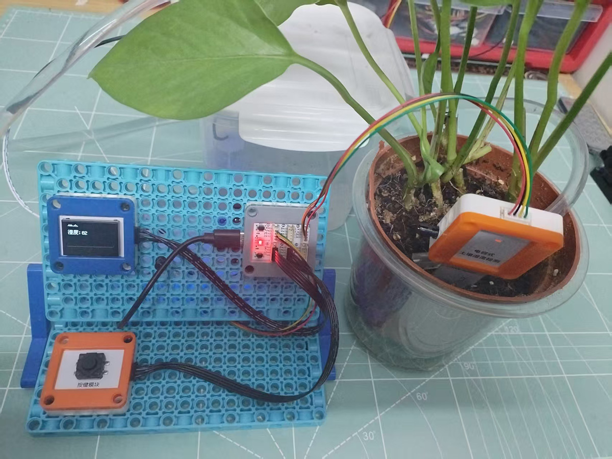
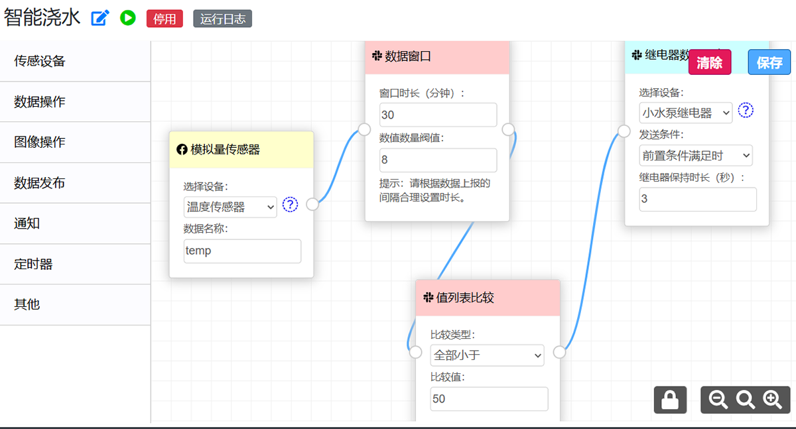
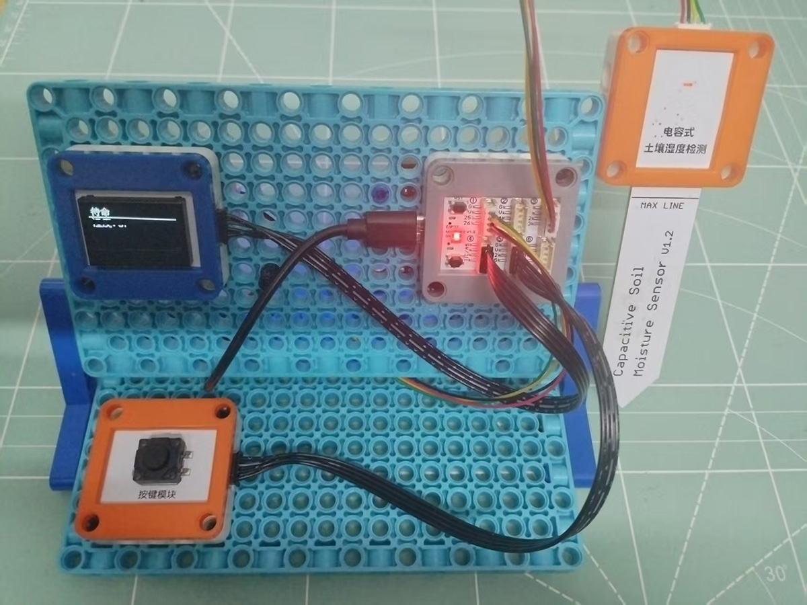
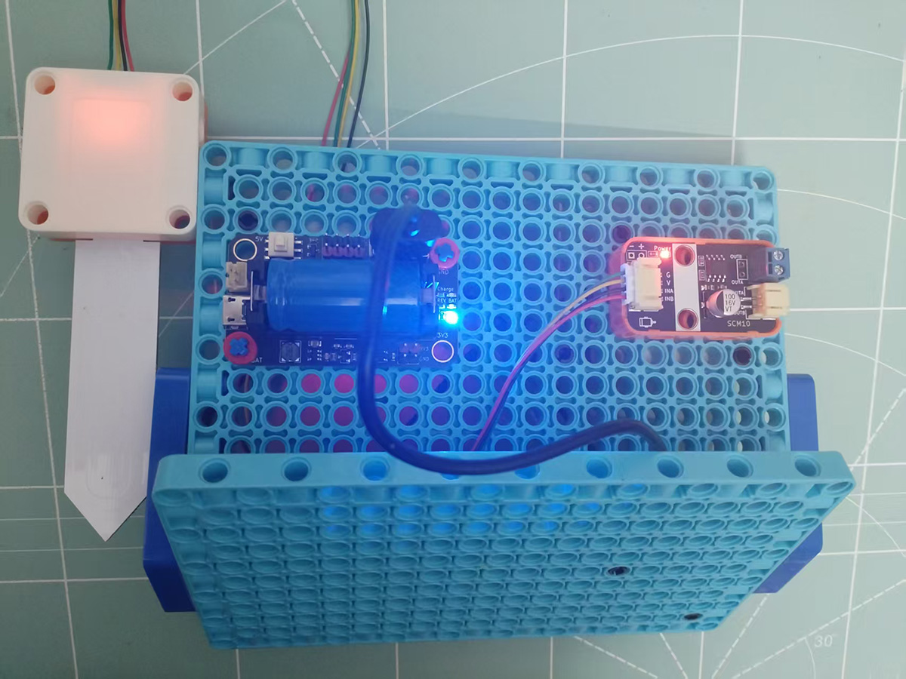

## 物联网自动浇花项目

物联网自动浇花系统是照顾植物的好帮手，支持智能控制和手动控制两种模式，可通过电脑端和手机端查看相关数据和控制浇水。

产品链接：[https://www.xpstem.com/product/auto-watering](https://www.xpstem.com/product/auto-watering)

### 控制模式
#### 手动模式
停用所有规则后，就是手动控制模式，在此模式下，需要手动发布控制数据用于控制水泵灌水。

#### 物联网模式
物联网控制方式由小鹏物联网系统的规则引擎来实现，通过基于图形化的方式进行数据流的处理规则配置，实现自动化和智能化，整个处理过程无需编写程序。

### 套件
正面图

反面图

#### 购买
